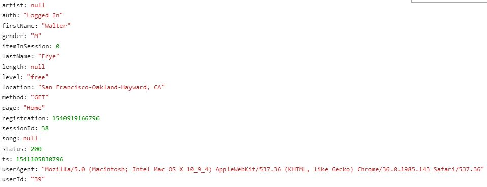
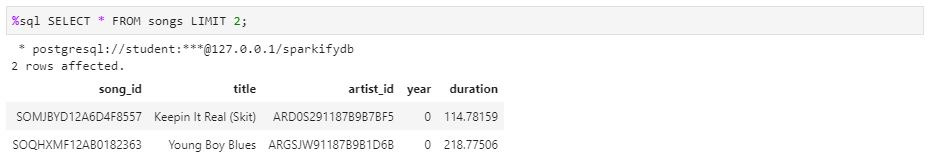
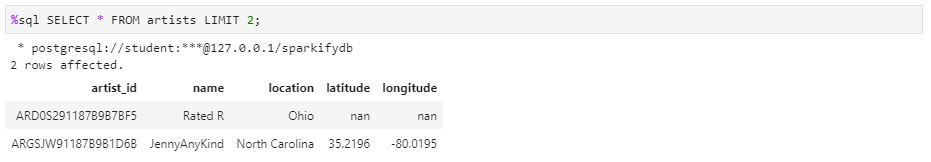
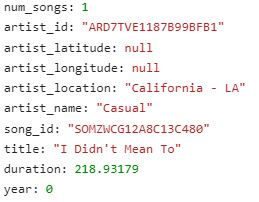
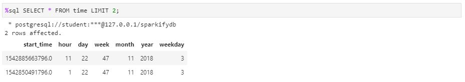
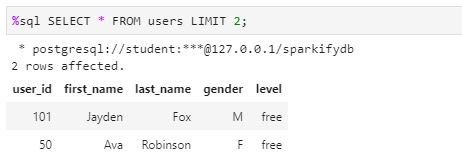
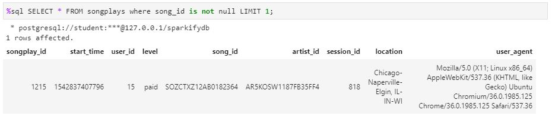

## Summary
ETL Process for ingesting Sparkify's JSON data to PostgreSQL.

## Purpose 
Converting log and data files to properly formatted and segregated tables would allow easy and instant query over the data for fetching meaningful results and insights.
***

## Running Instruction
	1. Open Terminal.
	2. Execute create_tables.py
	3. Execute etl.py
`python create_tables.py` and `python etl.py`
***

## Running Instruction
    1. data - Directory containing complete data set.
	2. Others - Extra files used at the time of development.
    3. Images - Directory containing screenshots of JSON files and all final tables.
	4. dashboard.ipynb - Dashboard for running queries and fetching data.
	5. create_tables.py - Python Script for dropping and creating tables.
	6. etl.py - Python Script for ingesting data.
	7. sql_queries.py - All the PostgreSQL queries used in the project at one place.
***

## Data Ingestion
<b>Song File - </b> The data within this File is used to populate `songs` and `artists` tables.  

* Sample LOG File -  

* Songs Table - 

* Artists Table - 

<b>Log File - </b> Copy command is used for ingesting this file. Due to this JSON data has been cleared up using `sed` linux replace command for replacing all the `"\"` to `"` and then the new modified files are used to populate a temorary table `log_data_json` with one file at a time loading to the temp table and then deleting in the next iteration. The data from files is used directly to populate `time` table and data from the temporary table `log_data_json` is used to populate `users` and `songplays` directly from Postgres.
    
    
* Sample Song File -  

* Time Table -  

* Users Table -  

* SongPlays Table -    

***
